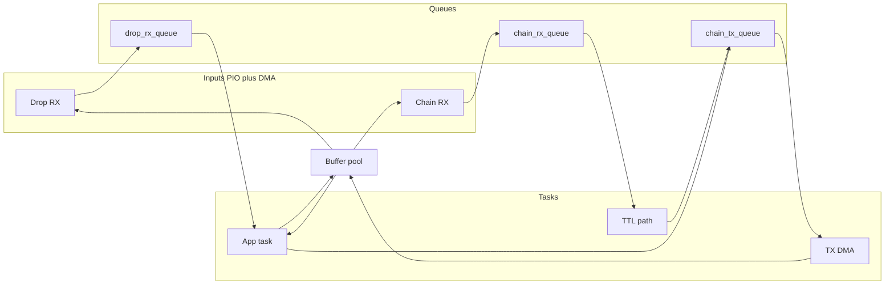

# Frame buffers and bus queues for the three ports

## Data flow summary

- **Downstream (drop) RX**: PIO + DMA fills a buffer → enqueue descriptor → **app task** dequeues and **processes** the frame (mock in Phase 1); then returns buffer to pool.
- **Upstream (chain) RX**: PIO + DMA fills a buffer → enqueue descriptor → **TTL path** dequeues, **decrements TTL** in place (drop if TTL becomes 0), then enqueues same buffer to **chain TX**; TX DMA sends it and on completion returns buffer to pool.
- **Upstream (chain) TX**: **Two producers** — (1) app task (frames it creates), (2) TTL path (forwarded chain frames). **One consumer** — DMA to SPI; when DMA is idle, pop a descriptor, start DMA; on completion return buffer to pool.

No trees are needed: strict FIFO and a single pool are enough. Queues hold **frame descriptors** (pointer + length); buffers are fixed-size and come from one **pool**.

---

## 1. Frame buffer size and descriptor

- **Max frame length**: Chain format is the longer format: 7 (header) + 64 (payload) + 4 (CRC) = **75 bytes**. Use a constant, e.g. `SPIOPEN_FRAME_BUF_SIZE = 80` (or derive from [lib/spiopen_protocol/spiopen_protocol.h](lib/spiopen_protocol/spiopen_protocol.h): `SPIOPEN_CHAIN_HEADER_BYTES + SPIOPEN_MAX_PAYLOAD + SPIOPEN_CRC_BYTES` rounded up).
- **Descriptor**: Small struct for queue items: `{ uint8_t *buf; uint8_t len; }` (or `size_t len`). Queues pass this by value (e.g. two words) or by pointer; passing by value keeps ownership simple (no separate descriptor allocator).
- **Buffer**: Opaque fixed-size block. No need for a separate “frame struct” that embeds the buffer; the pool owns raw buffers, and the descriptor (ptr, len) is enough.

---

## 2. Buffer pool

- **Role**: Provide buffers for (1) drop RX DMA, (2) chain RX DMA, (3) app task when it builds a new frame to send. All three paths **return** the buffer to the pool after use (drop: after app processes; chain RX: after TTL path has forwarded the buffer to TX and TX DMA has finished; app-originated TX: after TX DMA has finished).
- **Implementation**: Static array of `N` buffers (e.g. 8 or 16), each of size `SPIOPEN_FRAME_BUF_SIZE`. A **free list** (e.g. FreeRTOS queue of indices or pointers, or a simple stack) for “get” and “put”. Must be safe to call from tasks and from ISRs (e.g. DMA completion): use `xQueueSendFromISR` / `xQueueReceiveFromISR` for the free list, or a critical section.
- **API** (in new module, e.g. `frame_pool`):
  - `uint8_t *frame_pool_get(void)` — returns NULL if none free.
  - `void frame_pool_put(uint8_t *buf)` — return buffer to pool (idempotent / validated so only pool addresses are accepted).
- **Placement**: New files under [firmware/slave/](firmware/slave/) (e.g. `frame_pool.c` / `frame_pool.h`). Optionally extend [lib/spiopen_protocol/spiopen_protocol.h](lib/spiopen_protocol/spiopen_protocol.h) only with `SPIOPEN_FRAME_MAX_LEN` (or keep that in firmware) so protocol lib stays portable.

---

## 3. Queues (descriptor queues)

Use **FreeRTOS queues** for descriptor passing so both tasks and ISRs can enqueue/dequeue safely.

- **drop_rx_queue**
  - **Producers**: Drop RX DMA completion (ISR). Send descriptor (ptr, len) with `xQueueSendFromISR`.
  - **Consumer**: App task. Blocks on `xQueueReceive`, then “processes” the frame (mock: log/discard), then `frame_pool_put(ptr)`.
  - Item type: struct or two words (ptr + len). Queue depth: e.g. 4–8.
- **chain_rx_queue**
  - **Producer**: Chain RX DMA completion (ISR).
  - **Consumer**: TTL path (task or function run from a dedicated task). Dequeue → decrement TTL in `buf[1]`; if TTL == 0, `frame_pool_put(buf)` and drop; else send (buf, len) to chain_tx_queue.
- **chain_tx_queue**
  - **Producers**: (1) App task when it builds a frame; (2) TTL path when forwarding.
  - **Consumer**: TX logic (task or DMA completion chain). When SPI TX DMA is idle, dequeue (buf, len), start DMA transfer from `buf` for `len` bytes; on DMA completion, `frame_pool_put(buf)` and mark idle / start next if queue non-empty.

All three queues hold the same descriptor type (ptr + len). Queue depths can be small (4–8) and tuned so the pool is not overcommitted (e.g. pool size ≥ sum of max “in flight” buffers for each path).

---

## 4. TTL decrement path

- **Where**: Dedicated FreeRTOS task (e.g. `ttl_forward_task`) or a high-priority task that only does: loop — block on `chain_rx_queue`; take (buf, len); decrement `buf[1]` (TTL byte per [Architecture](docs/Architecture.md)); if TTL == 0, `frame_pool_put(buf)`; else `xQueueSend(chain_tx_queue, (buf, len))`. No copying of payload; single in-place byte change.
- **Drop rule**: TTL 0 → drop (return buffer to pool, do not send). No need to re-CRC the frame for the loopback/forward case if the protocol allows TTL change without CRC update for this phase; otherwise CRC recomputation can be added later.

---

## 5. Where PIO/DMA plug in (for later)

- **Variable-length RX**: PIO receives bytes (e.g. into DMA-backed buffer). Length is known only after header is available (DLC decoded). Options: (A) Two-phase DMA: first transfer fixed header (6 or 7 bytes), parse DLC to get data length, then second DMA for remainder; or (B) PIO state machine that counts bytes and signals “frame done” with length. The **descriptor** (ptr, len) passed into the RX queues is filled by this logic when a full frame is in the buffer.
- **TX**: When chain_tx_queue has a descriptor and SPI TX DMA is free, start one DMA transfer from `buf` of length `len`; chain DMA completion to “return buffer to pool and, if queue non-empty, start next transfer.”

This plan does not implement PIO/DMA; it defines the data structures and APIs so that when you add PIO/DMA, they only call `frame_pool_get`, fill the buffer, and send (buf, len) to the appropriate queue; and TX only dequeues and starts DMA, then returns the buffer on completion.

---

## 6. Suggested file layout and API surface

- **firmware/slave/frame_pool.h**, **frame_pool.c**
  - `SPIOPEN_FRAME_BUF_SIZE`, buffer pool, `frame_pool_get` / `frame_pool_put`, init.
- **firmware/slave/bus_queues.h**, **bus_queues.c**
  - Descriptor type (e.g. `typedef struct { uint8_t *buf; uint8_t len; } spiopen_frame_desc_t;`).
  - Creation/init of the three FreeRTOS queues (drop_rx, chain_rx, chain_tx).
  - Accessors: e.g. `send_to_drop_rx(buf, len)`, `receive_from_drop_rx(desc)`, and equivalents for chain_rx and chain_tx (with FromISR variants where the producer/consumer is an ISR).
- **main.c** (or **app_task.c**)
  - Create TTL task; app task loop: block on drop_rx_queue, process frame (mock), put buffer back; optionally build and send frames on chain_tx_queue for testing.
- **CMakeLists.txt**: Add `frame_pool.c`, `bus_queues.c` to the slave target.

---

## 7. Concurrency and pool sizing

- **Pool size**: At least “number of buffers that can be in flight.” Example: 2 in drop_rx_queue + 2 in chain_rx_queue + 2 in chain_tx_queue + 1 in TX DMA + 1 being processed by app ≈ 8. So pool size 8 or 16 is a good start.
- **ISR usage**: DMA completion handlers must use `xQueueSendFromISR` / `xQueueReceiveFromISR` and `frame_pool_put` (if pool is implemented with a queue, use the FromISR variant there too). No blocking in ISR.
- **TTL task priority**: Can be same as or higher than app task so that forwarding keeps up with RX; app task can remain the only one that “processes” drop frames and originates new TX frames.

---

## Summary

- **One buffer pool** (fixed-size buffers, free list), **one descriptor type** (ptr + len), **three queues** (drop_rx, chain_rx, chain_tx).
- **No trees or linked lists** for frame content; only a simple free list for the pool and FIFO queues for descriptors.
- App interacts only with: **dequeue from drop_rx** (process), **get buffer + enqueue to chain_tx** (send). TTL path connects **chain_rx → decrement TTL → chain_tx**. PIO/DMA only get/put buffers and enqueue/dequeue descriptors; no change to the protocol library itself beyond possibly a shared max-frame constant.

