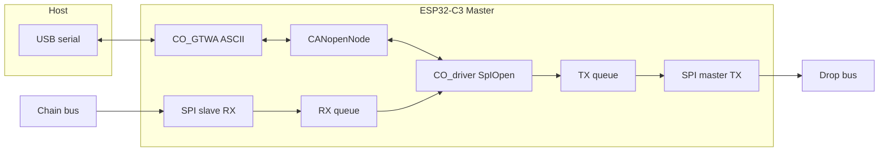

# SpIOpen CANopen Master (ESP32-C3 Zero) – Phase 2

## Scope

- **Board:** Waveshare ESP32-C3 Zero (ESP32-C3FH4, 15 exposed GPIOs, native USB, 3× SPI).
- **Role:** CANopenNode in **master** mode (NMT master, SDO client, LSS master); host talks over USB serial via **CANopen ASCII gateway** (CiA 309-3).
- **SpIOpen:** One **SPI master** for drop-bus TX (MOSI + CLK); one **SPI slave** for chain-bus RX (CLK + MOSI). Same frame format as slave; reuse [lib/spiopen_protocol](lib/spiopen_protocol/) and [lib/spiopen_canopen](lib/spiopen_canopen/).

---

## 1. Pin assignment and documentation

**ESP32-C3 Zero constraints (from Waveshare wiki and common practice):**

- GPIO12–17: not exposed (internal flash).
- GPIO2: strapping (must be high at boot) – avoid for critical signals.
- GPIO4–7: JTAG/flash – avoid.
- GPIO9: BOOT button; GPIO10: onboard WS2812 LED.
- Usable for general I/O: **0, 1, 3, 8, 10, 18, 19, 20, 21** (20/21 often used as UART0 TX/RX; with USB CDC, they can be repurposed).

**Recommended assignment (document in [firmware/master/README.md](firmware/master/README.md) and optionally a small `pins.h` or `docs` section):**

| Function             | GPIO | Role / note                       |
| -------------------- | ---- | --------------------------------- |
| Drop bus TX (master) | MOSI | **GPIO3** (SPI2 MOSI)             |
| Drop bus TX (master) | CLK  | **GPIO18** (SPI2 SCLK)            |
| Chain bus RX (slave) | CLK  | **GPIO0** (SPI slave clock input) |
| Chain bus RX (slave) | MOSI | **GPIO1** (SPI slave data input)  |

- **SPI2** (HSPI on ESP32-C3): master for drop-bus TX; only MOSI and SCLK used (no MISO/CS).
- **SPI3** (VSPI) or second SPI instance: slave for chain-bus RX; CLK and MOSI (data from slaves) only.
- USB: native USB (USB serial) for host ↔ ASCII gateway; no extra pins.

**Documentation:** Update [firmware/master/README.md](firmware/master/README.md) with board name, pin table, wiring note (drop bus: buffered output; chain bus: from last slave), and reference to [docs/Architecture.md](docs/Architecture.md). Optionally add a one-line note in [docs/DevelopmentPlan.md](docs/DevelopmentPlan.md) that Phase 2 master uses ESP32-C3 Zero and the above pins (with link to master README).

---

## 2. Project and build (ESP-IDF + FreeRTOS + CANopenNode)

- **Build system:** ESP-IDF (v5.x recommended); FreeRTOS is built-in.
- **Layout under [firmware/master/](firmware/master/):**
  - `CMakeLists.txt` (project, target `spiopen_master`), `main/CMakeLists.txt`, `main/main.c` (minimal init and startup).
  - `components/` or direct subdirs for SpIOpen and CANopen: e.g. `spiopen_transport/` (see below), `canopen_config/`, `canopen_od/`.
- **CANopenNode:** FetchContent or `idf_component_register` with a copy/fork; include:
  - Core: `CANopen.c`, `301/*.c`.
  - LSS master: `305/CO_LSSmaster.c` (and any 305 deps).
  - Gateway ASCII: `309/CO_gateway_ascii.c`.
  - Master-specific config (see below) so that NMT master, LSS master, and gateway are enabled; LSS slave can be disabled.
- **SpIOpen libs:** Add [lib/spiopen_protocol](lib/spiopen_protocol/) and [lib/spiopen_canopen](lib/spiopen_canopen/) as static libs (separate CMake subdirs or IDF components) and link them into `spiopen_master`. No Pico/hardware deps; they are already portable.

---

## 3. CANopenNode master and gateway configuration

- **Target config** (e.g. `canopen_config/CO_driver_target.h` and a `CO_config.h` override or project-wide defines):
  - Same type layout as slave for driver: [spiopen_canopen.h](lib/spiopen_canopen/spiopen_canopen.h) provides `CO_CANrxMsg_t` and read macros; target defines `CO_CANrx_t`, `CO_CANtx_t`, `CO_CANmodule_t`, lock macros (FreeRTOS mutex), and includes `spiopen_canopen.h`.
  - **CO_CONFIG_NMT:** enable **CO_CONFIG_NMT_MASTER** (NMT master).
  - **CO_CONFIG_LSS:** enable **CO_CONFIG_LSS_MASTER**; disable LSS slave if not needed.
  - **CO_CONFIG_GTW:** enable **CO_CONFIG_GTW_ASCII** and sub-features used by host: **CO_CONFIG_GTW_ASCII_SDO**, **CO_CONFIG_GTW_ASCII_NMT**, **CO_CONFIG_GTW_ASCII_LSS** (and optionally CO_CONFIG_GTW_ASCII_PRINT_HELP / LOG as desired).
  - **CO_CONFIG_FIFO:** enable **CO_CONFIG_FIFO_ASCII_COMMANDS** (and ASCII datatypes if SDO gateway is used), per CANopenNode gateway docs.
- **OD (Object Dictionary):** Minimal master OD: 1000, 1001, 1005, 1017, 1018, etc., and **309 gateway object(s)** for ASCII; SDO client and LSS master indices as required by CANopenNode (see example/gateway OD). No PDOs for the master itself unless needed later.
- **Init sequence:** `CO_new` → `CO_CANinit` (our driver) → `CO_CANopenInit` (with NMT master, etc.) → `CO_CANopenInitPDO` (minimal/no PDOs) → `CO_GTWA_init` (gateway, with read/write callbacks to USB serial) → `CO_CANsetNormalMode`. Then start a CANopen mainline task and a gateway process task (see below).

---

## 4. SpIOpen TX and RX (two SPI buses, reusing common code)

**Data flow (master):**

- **TX path (drop bus):** When the driver’s `CO_CANsend` is called, build a SpIOpen frame with [spiopen_frame_from_canopen_tx](lib/spiopen_canopen/spiopen_canopen.h) (from [spiopen_canopen](lib/spiopen_canopen/)); push (buf, len) to a TX queue; a **TX task** (or DMA completion) sends **preamble (0xAA)** then buffer over **SPI master** (MOSI + CLK @ 10 MHz, no CS). Buffer returned to pool after send.
- **RX path (chain bus):** **SPI slave** receives bytes (CLK + MOSI from upstream). Use a receive strategy that fits ESP32: either DMA + buffer or byte-by-byte state machine. Detect preamble 0xAA, then read header (4 bytes) → decode DLC → read payload + CRC. Validate with [spiopen_crc32_verify_frame](lib/spiopen_protocol/spiopen_protocol.h); push (buf, len) to RX queue. **CANopen task** blocks on RX queue, calls **spiopen_frame_to_canopen_rx** (from [spiopen_canopen](lib/spiopen_canopen/)) to fill `CO_CANrxMsg_t`, then runs the same RX filter/callback loop as the slave’s [spiopen_can_driver_inject_rx](firmware/slave/CO_driver.c) (or equivalent in master driver).
- **Common code:** Use [lib/spiopen_protocol](lib/spiopen_protocol/) for constants, CRC, DLC encode/decode, and [lib/spiopen_canopen](lib/spiopen_canopen/) for `spiopen_frame_to_canopen_rx` and `spiopen_frame_from_canopen_tx`. No changes to those libs unless a small optional helper is needed (e.g. max frame length constant for buffer sizing).
- **Buffers:** A small frame pool (e.g. 80-byte buffers, same as slave) for TX and RX; static or heap. Master does not need to “forward” TTL on chain (it is the consumer); chain RX only needs to capture one frame at a time and hand to the driver.

**ESP32-C3 specifics:**

- **SPI master (TX):** Use `spi_bus_config_t` and `spi_device_interface_config_t` (SPI2); only MOSI and SCLK pins; 10 MHz. Send preamble then frame in one or two transactions; consider DMA for larger frames.
- **SPI slave (RX):** ESP32 SPI slave API: configure CLK and MOSI as inputs; use SPI slave driver with a buffer and/or DMA. Slave is clocked by the external master (upstream slave); bit order and phase must match the SpIOpen spec (MSB first, same as slave). Implement preamble detection and length derivation from header (reuse DLC decode from spiopen_protocol) to know how many bytes to receive after the 4-byte header.

---

## 5. Custom CANopen driver (SpIOpen bridge, reusing spiopen_canopen)

- **Files:** e.g. `CO_driver.c` and `spiopen_can_driver.h` (or equivalent names) under `canopen_config/` or a single driver dir.
- **Behaviour (mirror slave where possible):**
  - **CO_CANmodule_init:** Store `CO_CANmodule_t`*; init rx/tx arrays; no hardware CAN bitrate.
  - **CO_CANsend:** Take buffer from pool; call **spiopen_frame_from_canopen_tx**(ident, DLC, data, buf, cap, TTL); enqueue (buf, len) to **SpIOpen TX queue**; on success clear bufferFull. Use a mutex for send if needed.
  - **RX injection:** From the CANopen task (or RX task): when an SpIOpen frame is available from the **RX queue**, call **spiopen_frame_to_canopen_rx**(buf, len, &s_rx_msg); then run the same RX filter loop as in [firmware/slave/CO_driver.c](firmware/slave/CO_driver.c) (match ident/mask, call CANrx_callback). Release buffer to pool after use.
  - **Locks:** Implement `CO_lock_can_send` / `CO_unlock_can_send` with a FreeRTOS mutex (as on slave).
- **Differences from slave:** Master **sends** on drop bus (TX queue → SPI master) and **receives** on chain bus (SPI slave → RX queue). No TTL decrement or chain forwarding; single consumer. Otherwise the same CO_CANrxMsg_t layout and spiopen_canopen API.

---

## 6. USB serial and ASCII gateway

- **USB:** Use ESP-IDF USB CDC (USB serial) for console; no UART pins required for host link if USB is the only host interface.
- **Gateway:** In the main loop or a dedicated task, call **CO_GTWA_process**(gtwa, enable, timeDifference_us, timerNext_us). Feed host input (USB CDC read) into **CO_GTWA_write**(gtwa, buf, count); and register a **read callback** that outputs gateway responses to USB CDC (so host sees SDO/NMT/LSS replies). Configure default node (e.g. 1) and net so that ASCII commands target the SpIOpen “network” and the single slave.

---

## 7. Task layout (summary)

- **CANopen task:** Block on SpIOpen RX queue (with timeout for timers); on frame: inject via driver (spiopen_frame_to_canopen_rx + filter/callbacks); then `CO_process` and gateway-related processing; update `timerNext_us` for next wake.
- **SpIOpen TX task:** Block on TX queue; when a frame is queued, send preamble + frame on SPI master; return buffer to pool.
- **Gateway / USB task:** Read from USB CDC; call `CO_GTWA_write`; in a timer or process call, run `CO_GTWA_process` and flush response callback to USB CDC.
- **Optional:** One combined task that runs `CO_process` and `CO_GTWA_process` with a single timeout source.

---

## 8. File and directory checklist

- [firmware/master/README.md](firmware/master/README.md): Board (ESP32-C3 Zero), pin table (drop TX: MOSI=3, CLK=18; chain RX: CLK=0, MOSI=1), wiring, build (ESP-IDF), and reference to Architecture/DevelopmentPlan.
- [firmware/master/](firmware/master/): ESP-IDF project (CMakeLists, main), `canopen_config/` (CO_driver_target.h, CO_driver.c, spiopen_can_driver.h), `canopen_od/` (minimal OD + gateway), SpIOpen transport (spiopen_tx_spi.c/h, spiopen_rx_slave.c/h or similar), frame pool, and linkage to lib/spiopen_protocol and lib/spiopen_canopen.
- [docs/DevelopmentPlan.md](docs/DevelopmentPlan.md): Short note that Phase 2 master is implemented on ESP32-C3 Zero with pinout in firmware/master/README.md (optional).

---

## 9. Verification

- Build `spiopen_master` with ESP-IDF; no duplicate symbols (rename any local `canopen.h` to e.g. `canopen_master.h` to avoid shadowing CANopenNode’s `CANopen.h` on case-insensitive filesystems).
- With one slave connected (drop bus from master MOSI/CLK, chain bus from slave to master RX CLK/MOSI): power-up, set default node 1, run ASCII commands over USB (e.g. SDO read 0x6200) and confirm reply; optionally NMT start and LSS inquire.

No implementation is performed in this plan; only structure, pin choices, and reuse of existing libs and slave driver patterns are specified.