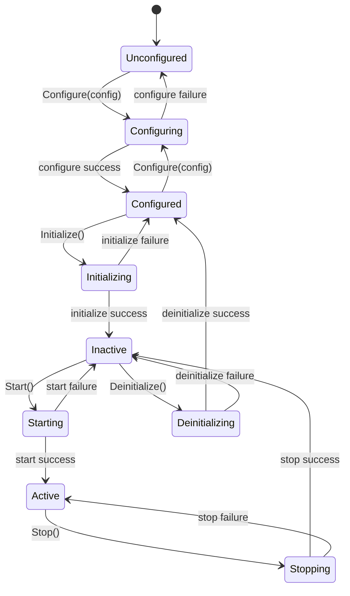

# SpIOpen Broker Lifecycle

This section defines the common lifecycle state machine shared by `FramePool`, `FrameMailbox`, `FrameBroker`, and the aggregated state view used by `FrameMessageAllocator`.

## Overview

All memory-backed broker components follow the same setup/teardown flow:

1. Configure with a class-specific config structure.
2. Initialize RTOS and memory resources.
3. Start runtime behavior (if applicable).
4. Stop runtime behavior.
5. Deinitialize resources.

The goal is to keep all lifecycle behavior predictable, thread-safe, and easy to supervise from higher-level application code.

## Design Considerations

- Use one shared lifecycle enum (`LifecycleState`) across the broker library.
- Keep transitions explicit and step-by-step (no convenience configure+initialize API).
- Separate configuration from allocation to support deterministic startup sequencing.
- Keep state variables atomic so control logic can observe lifecycle from multiple contexts.
- Use `etl::expected<void, ErrorEnum>` for transition APIs that can fail.
- Keep transition names aligned with CMSIS-style operational intent (configure, initialize, start, stop, deinitialize).

## Common Lifecycle State

`LifecycleState` includes the following values:

- `Unconfigured`
- `Configuring`
- `Configured`
- `Initializing`
- `Inactive`
- `Starting`
- `Active`
- `Stopping`
- `Deinitializing`
- `Mixed` (allocator aggregate-only state; not used as a concrete class runtime state)

## Common Lifecycle Functions

The following functions are the common lifecycle API pattern for memory-backed broker classes:

- `Configure(const Config&)`
- `Initialize()`
- `Start()`
- `Stop()`
- `Deinitialize()`
- `GetState() const`

`FrameBroker` also exposes `Reset()` for subscription/counter cleanup while inactive; it is intentionally not a state transition.

## Common Templated Interface

To enforce this pattern in code, memory-backed classes implement the templated lifecycle interface:

- `ILifecycleComponent<ConfigT, ErrorT>` in `include/spiopen_broker_lifecycle.h`

`FramePool`, `FrameMailbox`, and `FrameBroker` each implement this interface using their own config and error types.

## State Transition Diagram

## Implementation Notes By Class

- `FramePool`
  - Maintains a queue of available `FrameMessage*` entries.
  - Requeue on final message release is designed to be infallible in normal operation.

- `FrameMailbox`
  - Always creates its queue internally.
  - Optional external backing memory is supplied through config (`span<uint8_t>`); otherwise storage is allocated internally.

- `FrameBroker`
  - Owns one internal inbox mailbox.
  - Uses the same lifecycle transitions and delegates inbox mailbox setup through `FrameMailboxConfig`.

- `FrameMessageAllocator`
  - Aggregates lifecycle across enabled pools.
  - Uses `LifecycleState::Mixed` when underlying pools are not in a uniform state.

## Caller Expectations

- Callers should always progress in order: `Configure -> Initialize -> Start`.
- Callers should always reverse in order: `Stop -> Deinitialize`.
- Reconfiguration should occur only when not active.
- Supervisors should check `GetState()` and handle transition failures explicitly.
