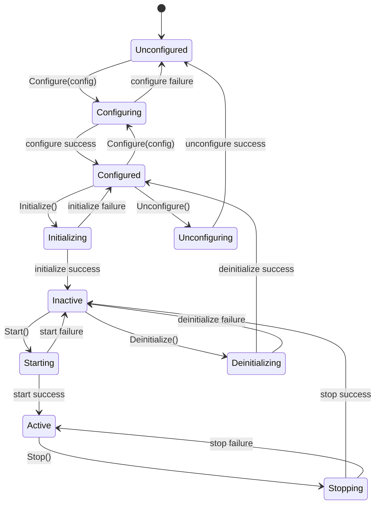

# SpIOpen Lifecycle Library

C++ library for common lifecycle state machines and interfaces shared by SpIOpen component libraries.

## Overview

This library centralizes the lifecycle contract used by SpIOpen components that need explicit setup and teardown.
The common flow (Represented by the `LifecycleTransition` enum) is:

1. `Configure(config)` to validate and load a configuration structure
2. `Initialize()` to acquire all resources (memory, peripherals, etc) required for operation
3. `Start()` to enter an Active mode where the component operates
4. `Stop()` to exit the Active mode but not yet relinquish resources
5. `Deinitialize()` to relinquish all resources gathered from Initialize()
6. `Unconfigure()` to clear the configuration loaded by Configure()

The goal is predictable lifecycle behavior, explicit transitions, and consistent error reporting across libraries.

## Design Principles

- Use one shared lifecycle enum (`LifecycleState`) across all participating components.
- Keep transitions explicit and step-by-step (no implicit configure+initialize shortcuts).
- Separate configuration validation from resource allocation.
- Use `etl::expected<..., ...>` return values for all transition operations.
- Support aggregate components that fan out lifecycle calls while preserving per-child error detail.

## Common Lifecycle State

`LifecycleState` values:

- `Unconfigured`
- `Configuring`
- `Configured`
- `Initializing`
- `Inactive`
- `Starting`
- `Active`
- `Stopping`
- `Deinitializing`
- `Unconfiguring`
- `Mixed` (aggregate-only state used when child states are not uniform)

## Common Lifecycle APIs

Leaf and aggregate implementations are based on:

- `ILifecycleComponent<ConfigT, ErrorT>`
- `IAggregateLifecycleComponent<LocalConfigT, ChildComponents...>`

Core lifecycle operations are:

- `Configure(const ConfigT&)`
- `ValidateAndNormalizeConfiguration(const ConfigT&)` (not a state transition, but a function used to validate the configuration structure)
- `Initialize()`
- `Start()`
- `Stop()`
- `Deinitialize()`
- `Unconfigure()`
- `GetState() const` (not a state transition, but a function used to retrieve the current `LifecycleState`)

`LifecycleErrorType` provides shared primary error categories (for example:
`InvalidConfiguration`, `InvalidState`, `ResourceFailure`, `AggregateError`), and
`AggregateLifecycleError` provides optional nested child error details.

## State Transition Diagram

## Contents

- `spiopen_lifecycle_core.h`: shared data types (states, errors, aggregate error helpers, config bundle)
- `spiopen_lifecycle_component.h`: `ILifecycleComponent` interface
- `spiopen_lifecycle_aggregate_component.h`: `IAggregateLifecycleComponent` interface and default fan-out behavior
- `spiopen_lifecycle.h`: umbrella include for convenience (`#include "spiopen_lifecycle.h"`)

## Configuration

This library currently has no KConfig feature toggles.